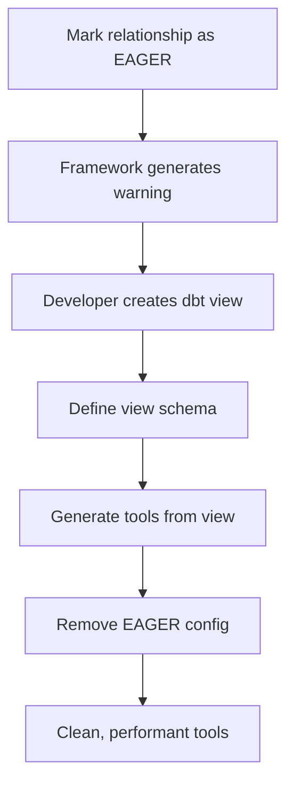

# Multi-Model Framework Specification

## 1. Executive Summary

This specification defines how our MXCP tool generation framework will be extended to support multi-model scenarios while maintaining the core principle of simplicity. The approach leverages dbt's existing `relationships` tests to automatically detect entity relationships and generates enhanced tools that can work across multiple related models.

### Core Principles

1. **Maintain Simplicity**: Build on our existing successful single-entity framework
2. **dbt-First**: Use dbt as the single source of truth for all relationship definitions
3. **Performance by Default**: Relationships are lazy-loaded unless explicitly configured otherwise
4. **ORM-Inspired**: Borrow proven patterns from JPA/Hibernate for configuration and behavior
5. **Zero Breaking Changes**: Existing single-entity tools continue to work unchanged

---

## 2. Relationship Detection and Classification

### 2.1 Detection Mechanism

The framework detects relationships by analyzing dbt `relationships` tests in `schema.yml` files. These tests serve as the authoritative source for foreign key relationships.

```yaml
# Example: fact_license_owners.yml
models:
  - name: fact_license_owners
    columns:
      - name: license_pk
        tests:
          - relationships:
              to: ref('dim_licenses')
              field: license_pk
```

### 2.2 Relationship Types

#### 2.2.1 Many-to-One (N-1) Relationships

**Definition**: A child entity references a single parent entity.

**Detection**: A model contains a column with a `relationships` test pointing to another model.

**Example**: `fact_license_owners.license_pk` → `dim_licenses.license_pk`

**Tool Enhancement**: The child entity's tool gains the ability to embed its parent.

#### 2.2.2 One-to-Many (1-N) Relationships

**Definition**: A parent entity can have multiple child entities.

**Detection**: Reverse analysis of N-1 relationships. When processing a model, the framework searches for other models that have `relationships` tests pointing to it.

**Example**: `dim_licenses` has many `fact_license_owners`

**Tool Enhancement**: The parent entity's tool gains the ability to embed its children.

#### 2.2.3 Many-to-Many (N-M) Relationships

**Definition**: Two entities are related through a junction table.

**Detection**: A model (junction table) contains at least two columns that each have `relationships` tests pointing to different models.

```yaml
# Example: jct_license_activities.yml
models:
  - name: jct_license_activities
    columns:
      - name: license_pk
        tests:
          - relationships:
              to: ref('dim_licenses')
              field: license_pk
      - name: activity_id
        tests:
          - relationships:
              to: ref('dim_activities')
              field: activity_id
```

**Tool Enhancement**: Both related entities gain the ability to filter by and embed the other entity through the junction table.

---

## 3. Enhanced Tool Generation

### 3.1 Dynamic Embedding

#### 3.1.1 Concept

Dynamic embedding allows API users to optionally include related entity data in their queries using an `embed` parameter. This follows the ORM pattern of lazy loading.

#### 3.1.2 Parameter Definition

Every tool for an entity that has relationships will gain an `embed` parameter:

```yaml
parameters:
  - name: embed
    type: array
    items:
      type: string
      enum: ["owners", "activities", "inspections"]
    description: "Optionally embed related entities"
    default: []
```

**LLM Guidance and Autocompletion:**

Just like our categorical tools, the `embed` parameter provides **enum values for LLM autocompletion and autocorrection**. This is crucial for LLM usability:

1. **Autocompletion**: LLMs can suggest valid embed options
2. **Autocorrection**: LLMs can fix typos like "owner" → "owners"
3. **Discovery**: LLMs learn what relationships are available
4. **Validation**: Invalid embed values are rejected with helpful error messages

**Example LLM Interaction:**

```
User: "Find licenses and include owner information"
LLM: "I'll search for licenses and embed the owner details using the 'owners' relationship."

API Call: GET /find_licenses?embed=owners

User: "Also include their business activities"  
LLM: "I'll add the activities relationship to the embed parameter."

API Call: GET /find_licenses?embed=owners,activities
```

**Error Handling for Invalid Embeds:**

```json
// Request: GET /find_licenses?embed=owner,activity (typos)
{
  "error": "Invalid embed values",
  "details": {
    "invalid_values": ["owner", "activity"],
    "suggestions": {
      "owner": "owners",
      "activity": "activities"
    },
    "valid_options": ["owners", "activities", "inspections"]
  }
}
```

**Dynamic Enum Generation:**

The framework automatically generates enum values based on detected relationships:

```python
def _generate_embed_enum(self, entity: BusinessEntity) -> List[str]:
    """Generate enum values for embed parameter"""
    embed_options = []
    
    # Add direct relationships
    for rel in entity.relationships:
        if rel.fetch_type != "NONE":
            alias = rel.alias or self._derive_alias(rel.to_model)
            embed_options.append(alias)
    
    # Add chained relationships (A.B)
    for rel in entity.relationships:
        if rel.fetch_type != "NONE":
            for nested_rel in self._get_nested_relationships(rel.to_model):
                if nested_rel.fetch_type != "NONE":
                    chain = f"{rel.alias}.{nested_rel.alias}"
                    embed_options.append(chain)
    
    return sorted(embed_options)
```

**Generated Enum Examples:**

```yaml
# Simple relationships
enum: ["owners", "activities", "inspections"]

# With chained relationships  
enum: [
  "owners",                    # Level 1: licenses -> owners
  "owners.addresses",          # Level 2: licenses -> owners -> addresses
  "owners.contacts",           # Level 2: licenses -> owners -> contacts
  "activities",                # Level 1: licenses -> activities
  "activities.permits",        # Level 2: licenses -> activities -> permits
  "inspections"                # Level 1: licenses -> inspections
]

# With aliases from meta configuration
enum: [
  "primary_owners",            # alias: "primary_owners"
  "business_activities",       # alias: "business_activities" 
  "compliance_history"         # alias: "compliance_history"
]
```

#### 3.1.3 SQL Generation for Embedding

**One-to-Many Embedding (Parent embeds children)**:
```sql
SELECT
  l.*,
  CASE 
    WHEN 'owners' = ANY($embed) THEN (
      SELECT json_group_array(json_object(
        'owner_name', o.owner_name,
        'owner_gender', o.owner_gender,
        'nationality', o.nationality
      ))
      FROM fact_license_owners o
      WHERE o.license_pk = l.license_pk
      ORDER BY o.owner_name ASC
    )
    ELSE NULL
  END as owners
FROM dim_licenses_v1 l
WHERE 1=1
  -- ... other filters
```

**Many-to-One Embedding (Child embeds parent)**:
```sql
SELECT
  o.*,
  CASE 
    WHEN 'license' = ANY($embed) THEN json_object(
      'license_pk', l.license_pk,
      'bl_name_en', l.bl_name_en,
      'bl_status_en', l.bl_status_en
    )
    ELSE NULL
  END as license
FROM fact_license_owners o
LEFT JOIN dim_licenses_v1 l ON o.license_pk = l.license_pk
WHERE 1=1
  -- ... other filters
```


**Many-to-Many Embedding**:
```sql
SELECT
  l.*,
  CASE 
    WHEN 'activities' = ANY($embed) THEN (
      SELECT json_group_array(json_object(
        'activity_id', a.activity_id,
        'activity_name', a.activity_name,
        'activity_type', a.activity_type
      ))
      FROM jct_license_activities ja
      JOIN dim_activities a ON ja.activity_id = a.activity_id
      WHERE ja.license_pk = l.license_pk
      ORDER BY a.activity_name ASC
    )
    ELSE NULL
  END as activities
FROM dim_licenses_v1 l
WHERE 1=1
  -- ... other filters
```

### 3.2 Cross-Entity Filtering

#### 3.2.1 Concept

Tools can include filter parameters for related entities, allowing queries like "find all licenses where the owner's nationality is 'UAE'".

#### 3.2.2 Parameter Generation

For each related entity, the framework generates filter parameters with prefixes to avoid naming conflicts:

```yaml
parameters:
  # Original license parameters
  - name: BlStatusEn
    type: string
    enum: ["Active", "Cancelled", "Expired", null]
    default: null
  
  # Related entity parameters (prefixed)
  - name: ownerNationality
    type: string
    description: "Filter by owner nationality"
    default: null
  
  - name: ownerGender
    type: string
    enum: ["Male", "Female", "Unknown", null]
    description: "Filter by owner gender"
    default: null
```

#### 3.2.3 SQL Generation for Cross-Entity Filtering

**One-to-Many Filtering**:
```sql
SELECT l.*
FROM dim_licenses_v1 l
WHERE 1=1
  -- Original filters
  AND ($BlStatusEn IS NULL OR l.bl_status_en = $BlStatusEn)
  
  -- Cross-entity filters using EXISTS
  AND ($ownerNationality IS NULL OR EXISTS (
    SELECT 1 FROM fact_license_owners o
    WHERE o.license_pk = l.license_pk
    AND o.nationality = $ownerNationality
  ))
  
  AND ($ownerGender IS NULL OR EXISTS (
    SELECT 1 FROM fact_license_owners o
    WHERE o.license_pk = l.license_pk
    AND o.owner_gender = $ownerGender
  ))
```

**Many-to-Many Filtering**:
```sql
SELECT l.*
FROM dim_licenses_v1 l
WHERE 1=1
  -- Original filters
  AND ($BlStatusEn IS NULL OR l.bl_status_en = $BlStatusEn)
  
  -- Cross-entity filters through junction table
  AND ($activityType IS NULL OR EXISTS (
    SELECT 1 FROM jct_license_activities ja
    JOIN dim_activities a ON ja.activity_id = a.activity_id
    WHERE ja.license_pk = l.license_pk
    AND a.activity_type = $activityType
  ))
```

---

## 4. Configuration and Control

### 4.1 ORM-Inspired Meta Configuration

To provide fine-grained control over relationship behavior, we introduce an optional `meta` configuration block in dbt schema files, inspired by JPA/Hibernate annotations.

### 4.2 Configuration Structure

```yaml
# In models/marts/schema.yml
models:
  - name: dim_licenses
    columns:
      - name: license_pk
        meta:
          mxcp_gen:
            relationships:
              - to: "fact_license_owners"
                fetch: "LAZY"        # LAZY | EAGER | NONE
                order_by: "owner_name ASC"
                cascade: "NONE"      # For future write operations
                alias: "owners"      # Custom name for embed parameter
              
              - to: "fact_inspections"
                fetch: "NONE"        # Disable this relationship
```

### 4.3 Fetch Type Behavior

#### 4.3.1 LAZY (Default)

- Relationship is available via the `embed` parameter
- No performance impact when not requested
- Ideal for optional or large related datasets

#### 4.3.2 EAGER

- **Important**: The framework does NOT implement eager loading with dynamic JOINs
- Instead, it logs a warning recommending creation of a dbt view
- This enforces the "dbt-first" principle for always-joined data

**Purpose of `fetch: "EAGER"`:**

The `EAGER` fetch type serves as a **architectural guidance mechanism** rather than a direct implementation feature. It helps identify relationships that should be materialized as dbt views instead of being handled through dynamic embedding.

**Why EAGER Doesn't Generate Dynamic JOINs:**

1. **Performance Principle**: Always-joined data should be pre-computed, not computed on-demand
2. **dbt-First Philosophy**: Complex joins belong in dbt models, not in generated SQL
3. **Maintainability**: Join logic should be explicit and version-controlled in dbt
4. **Reusability**: dbt views can be used by multiple tools and BI systems

**How EAGER Works:**

```yaml
# Configuration
models:
  - name: dim_licenses
    columns:
      - name: license_pk
        meta:
          mxcp_gen:
            relationships:
              - to: "fact_license_owners"
                fetch: "EAGER"  # Always needed with licenses
```

**Framework Behavior:**

1. **Detection**: Framework detects the EAGER relationship
2. **Warning Generation**: Logs a recommendation message
3. **Fallback**: Creates a LAZY relationship as fallback
4. **Documentation**: Includes recommendation in generated docs

**Generated Warning Message:**

```
WARNING: Relationship dim_licenses -> fact_license_owners marked as EAGER.
RECOMMENDATION: Consider creating a dbt view for better performance:

-- models/marts/views/vw_licenses_with_owners.sql
SELECT 
  l.*,
  o.owner_name,
  o.owner_gender,
  o.nationality
FROM {{ ref('dim_licenses') }} l
LEFT JOIN {{ ref('fact_license_owners') }} o 
  ON l.license_pk = o.license_pk 
  AND o.is_primary = true  -- Only primary owner
```

**Use Cases for `fetch: "EAGER"`:**

1. **Always-Required Data**
   ```yaml
   # License and primary owner are always shown together
   - to: "fact_primary_owners"
     fetch: "EAGER"
   ```

2. **Performance-Critical Paths**
   ```yaml
   # Core business data that's accessed 90%+ of the time
   - to: "dim_business_categories"
     fetch: "EAGER"
   ```

3. **Architectural Documentation**
   ```yaml
   # Document that this relationship is conceptually "eager"
   # Even if implemented as a dbt view
   - to: "fact_license_details"
     fetch: "EAGER"
     comment: "Core license data - see vw_licenses_full"
   ```

4. **Migration Planning**
   ```yaml
   # Mark relationships that should become dbt views
   - to: "dim_license_status_details"
     fetch: "EAGER"
     migration_target: "vw_licenses_with_status"
   ```

**Recommended Workflow:**



**Example Implementation:**

**Step 1: Mark as EAGER**
```yaml
# models/marts/schema.yml
models:
  - name: dim_licenses
    columns:
      - name: license_pk
        meta:
          mxcp_gen:
            relationships:
              - to: "fact_license_owners"
                fetch: "EAGER"  # Always needed
```

**Step 2: Create dbt View (following framework recommendation)**
```sql
-- models/marts/views/vw_licenses_with_owners.sql
{{ config(materialized='view') }}

SELECT 
  l.license_pk,
  l.bl_name_en,
  l.bl_status_en,
  l.emirate_name_en,
  
  -- Primary owner information (flattened)
  o.owner_name,
  o.owner_gender,
  o.nationality,
  o.owner_type

FROM {{ ref('dim_licenses') }} l
LEFT JOIN {{ ref('fact_license_owners') }} o 
  ON l.license_pk = o.license_pk 
  AND o.is_primary = true  -- Only primary owner
```

**Step 3: Define View Schema**
```yaml
# models/marts/views/schema.yml
models:
  - name: vw_licenses_with_owners
    description: "Licenses with primary owner information pre-joined"
    columns:
      - name: license_pk
        description: "License primary key"
        tests:
          - unique
          - not_null
      - name: owner_name
        description: "Primary owner name"
      - name: owner_gender
        description: "Primary owner gender"
```

**Step 4: Generate Tools**
```bash
python generate_mxcp_tools.py
```

**Result**: Framework generates a `find_licenses_with_owners` tool with all fields as parameters, no complex embedding needed.

**Comparison of Approaches:**

| Aspect | EAGER (Dynamic) | EAGER (dbt View) | LAZY |
|--------|-----------------|------------------|------|
| **Performance** | 🔴 Poor (always joins) | 🟢 Excellent (pre-computed) | 🟡 Good (on-demand) |
| **Maintainability** | 🔴 Hidden in generator | 🟢 Explicit in dbt | 🟢 Clear embedding |
| **Reusability** | 🔴 Tool-specific | 🟢 Org-wide asset | 🟡 Tool-specific |
| **Query Complexity** | 🔴 Complex SQL | 🟢 Simple SELECT | 🟡 Nested JSON |
| **Development Speed** | 🟡 Auto-generated | 🔴 Manual work | 🟢 Auto-generated |

**Best Practices:**

1. **Use EAGER Sparingly**: Only for truly always-needed relationships
2. **Follow Recommendations**: Create dbt views when framework suggests
3. **Document Decisions**: Comment why relationships are marked EAGER
4. **Performance Test**: Verify that EAGER relationships truly need pre-joining
5. **Review Regularly**: EAGER relationships may become LAZY as usage patterns change

**Configuration Options:**

```yaml
meta:
  mxcp_gen:
    eager_handling:
      auto_create_views: false        # Don't auto-create dbt views
      warn_on_eager: true            # Show warnings (default)
      fallback_to_lazy: true         # Create LAZY as fallback (default)
      include_recommendations: true   # Include view creation suggestions
```

The EAGER fetch type serves as an **architectural planning tool** that guides developers toward the most performant and maintainable solution: pre-computed dbt views for always-needed relationships.

#### 4.3.3 NONE

- Completely disables the relationship in generated tools
- Used to break circular dependencies or hide internal relationships
- Overrides automatic relationship detection

**Use Cases for `fetch: "NONE"`:**

1. **Breaking Circular Dependencies**
   ```yaml
   # Scenario: A -> B -> C -> A (circular)
   # dim_licenses -> fact_owners -> dim_businesses -> dim_licenses
   
   # In dim_businesses schema:
   models:
     - name: dim_businesses
       columns:
         - name: primary_license_pk
           meta:
             mxcp_gen:
               relationships:
                 - to: "dim_licenses"
                   fetch: "NONE"  # Break the cycle here
   ```
   
   **Why needed**: Without this, you'd get infinite loops where A embeds B, which embeds C, which embeds A again.

2. **Hiding Internal/Technical Relationships**
   ```yaml
   # Scenario: Hide audit or system tables from API users
   models:
     - name: dim_licenses
       columns:
         - name: license_pk
           meta:
             mxcp_gen:
               relationships:
                 - to: "audit_license_changes"
                   fetch: "NONE"  # Hide internal audit trail
                 - to: "system_metadata"
                   fetch: "NONE"  # Hide system internals
   ```
   
   **Why needed**: Some relationships exist for data integrity but shouldn't be exposed in business APIs.

3. **Performance-Sensitive Relationships**
   ```yaml
   # Scenario: Relationship to very large tables
   models:
     - name: dim_licenses
       columns:
         - name: license_pk
           meta:
             mxcp_gen:
               relationships:
                 - to: "fact_license_transactions"  # Millions of records
                   fetch: "NONE"  # Too expensive to embed
   ```
   
   **Why needed**: Some relationships are too expensive to expose via embedding, even lazily.

4. **Security and Privacy**
   ```yaml
   # Scenario: Sensitive data that shouldn't be accessible via general tools
   models:
     - name: fact_license_owners
       columns:
         - name: owner_pk
           meta:
             mxcp_gen:
               relationships:
                 - to: "sensitive_owner_financials"
                   fetch: "NONE"  # Hide sensitive financial data
                 - to: "owner_background_checks"
                   fetch: "NONE"  # Hide sensitive personal data
   ```
   
   **Why needed**: Compliance and privacy requirements may prohibit exposing certain relationships.

5. **Deprecated or Legacy Relationships**
   ```yaml
   # Scenario: Old relationships being phased out
   models:
     - name: dim_licenses
       columns:
         - name: legacy_category_id
           meta:
             mxcp_gen:
               relationships:
                 - to: "dim_legacy_categories"
                   fetch: "NONE"  # Being phased out, don't expose in new tools
   ```
   
   **Why needed**: Maintain data integrity during migrations while preventing new dependencies.

6. **Conditional Business Logic**
   ```yaml
   # Scenario: Relationships that only apply in certain contexts
   models:
     - name: dim_licenses
       columns:
         - name: special_permit_id
           meta:
             mxcp_gen:
               relationships:
                 - to: "dim_special_permits"
                   fetch: "NONE"  # Only relevant for 0.1% of licenses
   ```
   
   **Why needed**: Some relationships are too specialized for general-purpose tools.

**How `NONE` Works:**

1. **Relationship Detection**: The framework still detects the relationship from dbt tests
2. **Tool Generation**: The relationship is completely excluded from generated tools
3. **Parameter Generation**: No `embed` options or cross-entity filters are created
4. **SQL Generation**: No embedding SQL is generated for this relationship
5. **Documentation**: The relationship is not mentioned in generated tool documentation

**Configuration Priority:**

```yaml
# Priority order (highest to lowest):
# 1. Explicit meta configuration
# 2. Default behavior based on relationship detection

# Example: Override automatic detection
models:
  - name: dim_licenses
    columns:
      - name: license_pk
        # dbt detects relationship automatically via relationships test
        tests:
          - relationships:
              to: ref('fact_license_owners')
              field: license_pk
        meta:
          mxcp_gen:
            relationships:
              - to: "fact_license_owners"
                fetch: "NONE"  # Override: disable despite detected relationship
```

**Comparison with Other Fetch Types:**

| Aspect | LAZY | EAGER | NONE |
|--------|------|-------|------|
| **Relationship Detection** | ✅ Detected | ✅ Detected | ✅ Detected |
| **Tool Parameter** | ✅ `embed` option | ❌ No parameter | ❌ No parameter |
| **SQL Generation** | ✅ On-demand | ⚠️ Warning only | ❌ Not generated |
| **Cross-Entity Filters** | ✅ Available | ✅ Available | ❌ Not available |
| **Performance Impact** | 🟡 Only when used | 🔴 Always | 🟢 None |
| **Use Case** | General purpose | Always-needed data | Hide/disable |

**Implementation Details:**

```python
class RelationshipProcessor:
    def process_relationship(self, rel_config: Dict) -> Optional[RelationshipInfo]:
        """Process relationship configuration"""
        fetch_type = rel_config.get('fetch', 'LAZY')
        
        if fetch_type == 'NONE':
            # Log the exclusion for debugging
            logger.info(f"Relationship to {rel_config['to']} explicitly disabled via fetch: NONE")
            return None  # Exclude from tool generation
        
        elif fetch_type == 'EAGER':
            # Log warning about dbt-first approach
            logger.warning(
                f"Relationship to {rel_config['to']} marked as EAGER. "
                f"Consider creating a dbt view instead for better performance."
            )
            # Still create LAZY relationship but log the recommendation
            return self._create_lazy_relationship(rel_config)
        
        else:  # LAZY or default
            return self._create_lazy_relationship(rel_config)
```

**Best Practices:**

1. **Document Decisions**: Always comment why you're using `fetch: "NONE"`
2. **Review Regularly**: Periodically review NONE relationships - they may become relevant
3. **Alternative Solutions**: Consider if a separate, specialized tool might be better
4. **Security Review**: Ensure NONE is used appropriately for sensitive data
5. **Performance Testing**: Verify that NONE relationships truly need to be excluded

### 4.4 Default Behavior (Zero Configuration)

When no `meta` configuration is provided:

- All detected relationships default to `fetch: "LAZY"`
- Embed parameter names are derived from target model names
- Default ordering uses the target model's primary key
- No cross-entity filtering parameters are generated (to avoid parameter explosion)

---

## 5. Combined Entity Tools (dbt-First Approach)

### 5.1 Philosophy

For scenarios requiring complex, always-joined views of multiple entities, the framework promotes a "dbt-first" approach rather than trying to generate complex joins automatically.

### 5.2 Workflow

#### Step 1: Create a dbt View Model

```sql
-- models/marts/views/vw_comprehensive_licenses.sql
{{ config(materialized='view') }}

SELECT
  l.license_pk,
  l.bl_name_en,
  l.bl_status_en,
  l.emirate_name_en,
  
  -- Owner information (flattened)
  o.owner_name,
  o.owner_gender,
  o.nationality,
  
  -- Activity information (concatenated)
  GROUP_CONCAT(a.activity_name, '; ') as activity_names,
  COUNT(DISTINCT a.activity_id) as activity_count

FROM {{ ref('dim_licenses') }} l
LEFT JOIN {{ ref('fact_license_owners') }} o ON l.license_pk = o.license_pk
LEFT JOIN {{ ref('jct_license_activities') }} ja ON l.license_pk = ja.license_pk  
LEFT JOIN {{ ref('dim_activities') }} a ON ja.activity_id = a.activity_id

GROUP BY 
  l.license_pk, l.bl_name_en, l.bl_status_en, l.emirate_name_en,
  o.owner_name, o.owner_gender, o.nationality
```

#### Step 2: Define Schema

```yaml
# models/marts/views/schema.yml
models:
  - name: vw_comprehensive_licenses
    description: "Comprehensive view combining licenses with owner and activity data"
    columns:
      - name: license_pk
        description: "License primary key"
        tests:
          - unique
          - not_null
      
      - name: bl_name_en
        description: "Business name in English"
      
      - name: owner_name
        description: "Primary owner name"
      
      - name: activity_names
        description: "Concatenated activity names"
```

#### Step 3: Generate Tools

```bash
python generate_mxcp_tools.py
```

The framework treats the view like any other model and generates a comprehensive search tool with all the flattened fields as parameters.

### 5.3 Advantages

- **Explicit Logic**: Join logic is visible and version-controlled in SQL
- **Performance**: Can be materialized as a table for better performance
- **Reusability**: The view can be used by BI tools, other dbt models, etc.
- **Maintainability**: Changes to join logic are managed through dbt's standard workflow


---

## 6. Implementation Architecture

### 6.1 Enhanced Semantic Analyzer

```python
@dataclass
class RelationshipInfo:
    """Information about a relationship between entities"""
    from_model: str
    to_model: str
    from_column: str
    to_column: str
    relationship_type: str  # "one_to_many", "many_to_one", "many_to_many"
    fetch_type: str = "LAZY"
    order_by: Optional[str] = None
    alias: Optional[str] = None

class EnhancedSemanticAnalyzer(SemanticAnalyzer):
    """Extended analyzer with relationship detection"""
    
    def extract_relationships(self, manifest: Dict) -> Dict[str, List[RelationshipInfo]]:
        """Extract all relationships from dbt manifest"""
        relationships = {}
        
        # First pass: Find all relationship tests
        relationship_tests = self._find_relationship_tests(manifest)
        
        # Second pass: Classify relationship types
        for test in relationship_tests:
            rel_info = self._classify_relationship(test, manifest)
            
            # Add to both sides for bi-directional support
            if rel_info.from_model not in relationships:
                relationships[rel_info.from_model] = []
            relationships[rel_info.from_model].append(rel_info)
            
            # Create reverse relationship
            reverse_rel = self._create_reverse_relationship(rel_info)
            if reverse_rel.from_model not in relationships:
                relationships[reverse_rel.from_model] = []
            relationships[reverse_rel.from_model].append(reverse_rel)
        
        return relationships
    
    def _detect_junction_tables(self, manifest: Dict) -> List[str]:
        """Detect models that serve as junction tables for N-M relationships"""
        junction_tables = []
        
        for model_name, tests in self._find_relationship_tests(manifest).items():
            if len(tests) >= 2:
                # Check if tests point to different models
                target_models = {test['to_model'] for test in tests}
                if len(target_models) >= 2:
                    junction_tables.append(model_name)
        
        return junction_tables
```

### 6.2 Enhanced Tool Generator

```python
class MultiModelToolGenerator(ToolGenerator):
    """Extended tool generator with multi-model support"""
    
    def __init__(self, relationships: Dict[str, List[RelationshipInfo]]):
        super().__init__()
        self.relationships = relationships
    
    def _generate_search_tool(self, entity: BusinessEntity) -> Dict[str, Any]:
        """Generate enhanced search tool with relationship support"""
        tool = super()._generate_search_tool(entity)
        
        # Add embed parameter if entity has relationships
        if entity.name in self.relationships:
            embed_options = self._get_embed_options(entity)
            if embed_options:
                tool['tool']['parameters'].append({
                    "name": "embed",
                    "type": "array",
                    "items": {
                        "type": "string",
                        "enum": embed_options
                    },
                    "description": "Optionally embed related entities",
                    "default": []
                })
        
        # Add cross-entity filter parameters
        cross_entity_params = self._generate_cross_entity_parameters(entity)
        tool['tool']['parameters'].extend(cross_entity_params)
        
        return tool
    
    def _generate_enhanced_sql(self, entity: BusinessEntity) -> str:
        """Generate SQL with embedding and cross-entity filtering support"""
        base_sql = super()._generate_search_sql(entity)
        
        # Add embedding logic
        embed_selects = self._generate_embed_selects(entity)
        
        # Add cross-entity filters
        cross_entity_filters = self._generate_cross_entity_filters(entity)
        
        return f"""
        SELECT
          {entity.name}.*,
          {embed_selects}
        FROM {entity.primary_model.name}_v1 {entity.name}
        WHERE 1=1
          {base_sql.where_clauses}
          {cross_entity_filters}
        ORDER BY {self._get_default_order_column(entity)} DESC
        LIMIT $limit
        OFFSET $offset
        """
```

---

## 7. Performance Considerations

### 7.1 Query Performance

#### 7.1.1 Embedding Performance

- **Lazy Loading**: Embedding only executes when requested, avoiding unnecessary JOINs
- **Subquery Optimization**: Use correlated subqueries with JSON aggregation for 1-N relationships
- **LEFT JOIN Strategy**: Use LEFT JOINs for N-1 relationships to maintain performance

#### 7.1.2 Cross-Entity Filtering Performance

- **EXISTS Strategy**: Use `EXISTS` subqueries instead of JOINs for filtering to avoid row multiplication
- **Index Recommendations**: Document recommended indexes for foreign key columns
- **Query Plan Analysis**: Include EXPLAIN output in generated SQL comments

### 7.2 Parameter Explosion Prevention

#### 7.2.1 Selective Parameter Generation

By default, cross-entity filtering parameters are NOT generated to prevent overwhelming the API. They must be explicitly enabled via configuration:

```yaml
meta:
  mxcp_gen:
    cross_entity_filters:
      enabled: true
      include_fields: ["nationality", "gender", "activity_type"]
```

#### 7.2.2 Parameter Grouping

Related parameters can be grouped into objects to reduce top-level parameter count:

```yaml
parameters:
  - name: ownerFilters
    type: object
    properties:
      nationality:
        type: string
      gender:
        type: string
        enum: ["Male", "Female", "Unknown"]
```

---

## 8. Migration Strategy

### 8.1 Backward Compatibility

- **Zero Breaking Changes**: Existing single-entity tools continue to work unchanged
- **Additive Enhancement**: New parameters and features are added, not modified
- **Opt-in Behavior**: Multi-model features are opt-in via configuration

### 8.2 Implementation Phases

#### Phase 1: Relationship Detection
- Implement relationship analysis from dbt manifest
- Add relationship information to BusinessEntity objects
- No tool generation changes yet

#### Phase 2: Dynamic Embedding
- Add `embed` parameter to existing tools
- Implement SQL generation for embedding
- Test with simple 1-N relationships

#### Phase 3: Cross-Entity Filtering
- Add cross-entity filter parameters
- Implement `EXISTS`