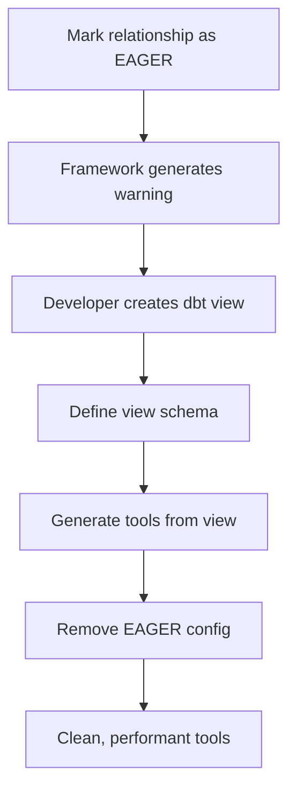

# Multi-Model Framework Specification

## 1. Executive Summary

This specification defines how our MXCP tool generation framework will be extended to support multi-model scenarios while maintaining the core principle of simplicity. The approach leverages dbt's existing `relationships` tests to automatically detect entity relationships and generates enhanced tools that can work across multiple related models.

### Core Principles

1. **Maintain Simplicity**: Build on our existing successful single-entity framework
2. **dbt-First**: Use dbt as the single source of truth for all relationship definitions
3. **Performance by Default**: Relationships are lazy-loaded unless explicitly configured otherwise
4. **ORM-Inspired**: Borrow proven patterns from JPA/Hibernate for configuration and behavior
5. **Zero Breaking Changes**: Existing single-entity tools continue to work unchanged

---

## 2. Relationship Detection and Classification

### 2.1 Detection Mechanism

The framework detects relationships by analyzing dbt `relationships` tests in `schema.yml` files. These tests serve as the authoritative source for foreign key relationships.

```yaml
# Example: fact_license_owners.yml
models:
  - name: fact_license_owners
    columns:
      - name: license_pk
        tests:
          - relationships:
              to: ref('dim_licenses')
              field: license_pk
```

### 2.2 Relationship Types

#### 2.2.1 Many-to-One (N-1) Relationships

**Definition**: A child entity references a single parent entity.

**Detection**: A model contains a column with a `relationships` test pointing to another model.

**Example**: `fact_license_owners.license_pk` → `dim_licenses.license_pk`

**Tool Enhancement**: The child entity's tool gains the ability to embed its parent.

#### 2.2.2 One-to-Many (1-N) Relationships

**Definition**: A parent entity can have multiple child entities.

**Detection**: Reverse analysis of N-1 relationships. When processing a model, the framework searches for other models that have `relationships` tests pointing to it.

**Example**: `dim_licenses` has many `fact_license_owners`

**Tool Enhancement**: The parent entity's tool gains the ability to embed its children.

#### 2.2.3 Many-to-Many (N-M) Relationships

**Definition**: Two entities are related through a junction table.

**Detection**: A model (junction table) contains at least two columns that each have `relationships` tests pointing to different models.

```yaml
# Example: jct_license_activities.yml
models:
  - name: jct_license_activities
    columns:
      - name: license_pk
        tests:
          - relationships:
              to: ref('dim_licenses')
              field: license_pk
      - name: activity_id
        tests:
          - relationships:
              to: ref('dim_activities')
              field: activity_id
```

**Tool Enhancement**: Both related entities gain the ability to filter by and embed the other entity through the junction table.

---

## 3. Enhanced Tool Generation

### 3.1 Dynamic Embedding

#### 3.1.1 Concept

Dynamic embedding allows API users to optionally include related entity data in their queries using an `embed` parameter. This follows the ORM pattern of lazy loading.

#### 3.1.2 Parameter Definition

Every tool for an entity that has relationships will gain an `embed` parameter:

```yaml
parameters:
  - name: embed
    type: array
    items:
      type: string
      enum: ["owners", "activities", "inspections"]
    description: "Optionally embed related entities"
    default: []
```

#### 3.1.3 SQL Generation for Embedding

**One-to-Many Embedding (Parent embeds children)**:
```sql
SELECT
  l.*,
  CASE 
    WHEN 'owners' = ANY($embed) THEN (
      SELECT json_group_array(json_object(
        'owner_name', o.owner_name,
        'owner_gender', o.owner_gender,
        'nationality', o.nationality
      ))
      FROM fact_license_owners o
      WHERE o.license_pk = l.license_pk
      ORDER BY o.owner_name ASC
    )
    ELSE NULL
  END as owners
FROM dim_licenses_v1 l
WHERE 1=1
  -- ... other filters
```

**Many-to-One Embedding (Child embeds parent)**:
```sql
SELECT
  o.*,
  CASE 
    WHEN 'license' = ANY($embed) THEN json_object(
      'license_pk', l.license_pk,
      'bl_name_en', l.bl_name_en,
      'bl_status_en', l.bl_status_en
    )
    ELSE NULL
  END as license
FROM fact_license_owners o
LEFT JOIN dim_licenses_v1 l ON o.license_pk = l.license_pk
WHERE 1=1
  -- ... other filters
```


**Many-to-Many Embedding**:
```sql
SELECT
  l.*,
  CASE 
    WHEN 'activities' = ANY($embed) THEN (
      SELECT json_group_array(json_object(
        'activity_id', a.activity_id,
        'activity_name', a.activity_name,
        'activity_type', a.activity_type
      ))
      FROM jct_license_activities ja
      JOIN dim_activities a ON ja.activity_id = a.activity_id
      WHERE ja.license_pk = l.license_pk
      ORDER BY a.activity_name ASC
    )
    ELSE NULL
  END as activities
FROM dim_licenses_v1 l
WHERE 1=1
  -- ... other filters
```

### 3.2 Cross-Entity Filtering

#### 3.2.1 Concept

Tools can include filter parameters for related entities, allowing queries like "find all licenses where the owner's nationality is 'UAE'".

#### 3.2.2 Parameter Generation

For each related entity, the framework generates filter parameters with prefixes to avoid naming conflicts:

```yaml
parameters:
  # Original license parameters
  - name: BlStatusEn
    type: string
    enum: ["Active", "Cancelled", "Expired", null]
    default: null
  
  # Related entity parameters (prefixed)
  - name: ownerNationality
    type: string
    description: "Filter by owner nationality"
    default: null
  
  - name: ownerGender
    type: string
    enum: ["Male", "Female", "Unknown", null]
    description: "Filter by owner gender"
    default: null
```

#### 3.2.3 SQL Generation for Cross-Entity Filtering

**One-to-Many Filtering**:
```sql
SELECT l.*
FROM dim_licenses_v1 l
WHERE 1=1
  -- Original filters
  AND ($BlStatusEn IS NULL OR l.bl_status_en = $BlStatusEn)
  
  -- Cross-entity filters using EXISTS
  AND ($ownerNationality IS NULL OR EXISTS (
    SELECT 1 FROM fact_license_owners o
    WHERE o.license_pk = l.license_pk
    AND o.nationality = $ownerNationality
  ))
  
  AND ($ownerGender IS NULL OR EXISTS (
    SELECT 1 FROM fact_license_owners o
    WHERE o.license_pk = l.license_pk
    AND o.owner_gender = $ownerGender
  ))
```

**Many-to-Many Filtering**:
```sql
SELECT l.*
FROM dim_licenses_v1 l
WHERE 1=1
  -- Original filters
  AND ($BlStatusEn IS NULL OR l.bl_status_en = $BlStatusEn)
  
  -- Cross-entity filters through junction table
  AND ($activityType IS NULL OR EXISTS (
    SELECT 1 FROM jct_license_activities ja
    JOIN dim_activities a ON ja.activity_id = a.activity_id
    WHERE ja.license_pk = l.license_pk
    AND a.activity_type = $activityType
  ))
```

---

## 4. Configuration and Control

### 4.1 ORM-Inspired Meta Configuration

To provide fine-grained control over relationship behavior, we introduce an optional `meta` configuration block in dbt schema files, inspired by JPA/Hibernate annotations.

### 4.2 Configuration Structure

```yaml
# In models/marts/schema.yml
models:
  - name: dim_licenses
    columns:
      - name: license_pk
        meta:
          mxcp_gen:
            relationships:
              - to: "fact_license_owners"
                fetch: "LAZY"        # LAZY | EAGER | NONE
                order_by: "owner_name ASC"
                cascade: "NONE"      # For future write operations
                alias: "owners"      # Custom name for embed parameter
              
              - to: "fact_inspections"
                fetch: "NONE"        # Disable this relationship
```

### 4.3 Fetch Type Behavior

#### 4.3.1 LAZY (Default)

- Relationship is available via the `embed` parameter
- No performance impact when not requested
- Ideal for optional or large related datasets

#### 4.3.2 EAGER

- **Important**: The framework does NOT implement eager loading with dynamic JOINs
- Instead, it logs a warning recommending creation of a dbt view
- This enforces the "dbt-first" principle for always-joined data

**Purpose of `fetch: "EAGER"`:**

The `EAGER` fetch type serves as a **architectural guidance mechanism** rather than a direct implementation feature. It helps identify relationships that should be materialized as dbt views instead of being handled through dynamic embedding.

**Why EAGER Doesn't Generate Dynamic JOINs:**

1. **Performance Principle**: Always-joined data should be pre-computed, not computed on-demand
2. **dbt-First Philosophy**: Complex joins belong in dbt models, not in generated SQL
3. **Maintainability**: Join logic should be explicit and version-controlled in dbt
4. **Reusability**: dbt views can be used by multiple tools and BI systems

**How EAGER Works:**

```yaml
# Configuration
models:
  - name: dim_licenses
    columns:
      - name: license_pk
        meta:
          mxcp_gen:
            relationships:
              - to: "fact_license_owners"
                fetch: "EAGER"  # Always needed with licenses
```

**Framework Behavior:**

1. **Detection**: Framework detects the EAGER relationship
2. **Warning Generation**: Logs a recommendation message
3. **Fallback**: Creates a LAZY relationship as fallback
4. **Documentation**: Includes recommendation in generated docs

**Generated Warning Message:**

```
WARNING: Relationship dim_licenses -> fact_license_owners marked as EAGER.
RECOMMENDATION: Consider creating a dbt view for better performance:

-- models/marts/views/vw_licenses_with_owners.sql
SELECT 
  l.*,
  o.owner_name,
  o.owner_gender,
  o.nationality
FROM {{ ref('dim_licenses') }} l
LEFT JOIN {{ ref('fact_license_owners') }} o 
  ON l.license_pk = o.license_pk 
  AND o.is_primary = true  -- Only primary owner
```

**Use Cases for `fetch: "EAGER"`:**

1. **Always-Required Data**
   ```yaml
   # License and primary owner are always shown together
   - to: "fact_primary_owners"
     fetch: "EAGER"
   ```

2. **Performance-Critical Paths**
   ```yaml
   # Core business data that's accessed 90%+ of the time
   - to: "dim_business_categories"
     fetch: "EAGER"
   ```

3. **Architectural Documentation**
   ```yaml
   # Document that this relationship is conceptually "eager"
   # Even if implemented as a dbt view
   - to: "fact_license_details"
     fetch: "EAGER"
     comment: "Core license data - see vw_licenses_full"
   ```

4. **Migration Planning**
   ```yaml
   # Mark relationships that should become dbt views
   - to: "dim_license_status_details"
     fetch: "EAGER"
     migration_target: "vw_licenses_with_status"
   ```

**Recommended Workflow:**



**Example Implementation:**

**Step 1: Mark as EAGER**
```yaml
# models/marts/schema.yml
models:
  - name: dim_licenses
    columns:
      - name: license_pk
        meta:
          mxcp_gen:
            relationships:
              - to: "fact_license_owners"
                fetch: "EAGER"  # Always needed
```

**Step 2: Create dbt View (following framework recommendation)**
```sql
-- models/marts/views/vw_licenses_with_owners.sql
{{ config(materialized='view') }}

SELECT 
  l.license_pk,
  l.bl_name_en,
  l.bl_status_en,
  l.emirate_name_en,
  
  -- Primary owner information (flattened)
  o.owner_name,
  o.owner_gender,
  o.nationality,
  o.owner_type

FROM {{ ref('dim_licenses') }} l
LEFT JOIN {{ ref('fact_license_owners') }} o 
  ON l.license_pk = o.license_pk 
  AND o.is_primary = true  -- Only primary owner
```

**Step 3: Define View Schema**
```yaml
# models/marts/views/schema.yml
models:
  - name: vw_licenses_with_owners
    description: "Licenses with primary owner information pre-joined"
    columns:
      - name: license_pk
        description: "License primary key"
        tests:
          - unique
          - not_null
      - name: owner_name
        description: "Primary owner name"
      - name: owner_gender
        description: "Primary owner gender"
```

**Step 4: Generate Tools**
```bash
python generate_mxcp_tools.py
```

**Result**: Framework generates a `find_licenses_with_owners` tool with all fields as parameters, no complex embedding needed.

**Comparison of Approaches:**

| Aspect | EAGER (Dynamic) | EAGER (dbt View) | LAZY |
|--------|-----------------|------------------|------|
| **Performance** | 🔴 Poor (always joins) | 🟢 Excellent (pre-computed) | 🟡 Good (on-demand) |
| **Maintainability** | 🔴 Hidden in generator | 🟢 Explicit in dbt | 🟢 Clear embedding |
| **Reusability** | 🔴 Tool-specific | 🟢 Org-wide asset | 🟡 Tool-specific |
| **Query Complexity** | 🔴 Complex SQL | 🟢 Simple SELECT | 🟡 Nested JSON |
| **Development Speed** | 🟡 Auto-generated | 🔴 Manual work | 🟢 Auto-generated |

**Best Practices:**

1. **Use EAGER Sparingly**: Only for truly always-needed relationships
2. **Follow Recommendations**: Create dbt views when framework suggests
3. **Document Decisions**: Comment why relationships are marked EAGER
4. **Performance Test**: Verify that EAGER relationships truly need pre-joining
5. **Review Regularly**: EAGER relationships may become LAZY as usage patterns change

**Configuration Options:**

```yaml
meta:
  mxcp_gen:
    eager_handling:
      auto_create_views: false        # Don't auto-create dbt views
      warn_on_eager: true            # Show warnings (default)
      fallback_to_lazy: true         # Create LAZY as fallback (default)
      include_recommendations: true   # Include view creation suggestions
```

The EAGER fetch type serves as an **architectural planning tool** that guides developers toward the most performant and maintainable solution: pre-computed dbt views for always-needed relationships.

#### 4.3.3 NONE

- Completely disables the relationship in generated tools
- Used to break circular dependencies or hide internal relationships
- Overrides automatic relationship detection

**Use Cases for `fetch: "NONE"`:**

1. **Breaking Circular Dependencies**
   ```yaml
   # Scenario: A -> B -> C -> A (circular)
   # dim_licenses -> fact_owners -> dim_businesses -> dim_licenses
   
   # In dim_businesses schema:
   models:
     - name: dim_businesses
       columns:
         - name: primary_license_pk
           meta:
             mxcp_gen:
               relationships:
                 - to: "dim_licenses"
                   fetch: "NONE"  # Break the cycle here
   ```
   
   **Why needed**: Without this, you'd get infinite loops where A embeds B, which embeds C, which embeds A again.

2. **Hiding Internal/Technical Relationships**
   ```yaml
   # Scenario: Hide audit or system tables from API users
   models:
     - name: dim_licenses
       columns:
         - name: license_pk
           meta:
             mxcp_gen:
               relationships:
                 - to: "audit_license_changes"
                   fetch: "NONE"  # Hide internal audit trail
                 - to: "system_metadata"
                   fetch: "NONE"  # Hide system internals
   ```
   
   **Why needed**: Some relationships exist for data integrity but shouldn't be exposed in business APIs.

3. **Performance-Sensitive Relationships**
   ```yaml
   # Scenario: Relationship to very large tables
   models:
     - name: dim_licenses
       columns:
         - name: license_pk
           meta:
             mxcp_gen:
               relationships:
                 - to: "fact_license_transactions"  # Millions of records
                   fetch: "NONE"  # Too expensive to embed
   ```
   
   **Why needed**: Some relationships are too expensive to expose via embedding, even lazily.

4. **Security and Privacy**
   ```yaml
   # Scenario: Sensitive data that shouldn't be accessible via general tools
   models:
     - name: fact_license_owners
       columns:
         - name: owner_pk
           meta:
             mxcp_gen:
               relationships:
                 - to: "sensitive_owner_financials"
                   fetch: "NONE"  # Hide sensitive financial data
                 - to: "owner_background_checks"
                   fetch: "NONE"  # Hide sensitive personal data
   ```
   
   **Why needed**: Compliance and privacy requirements may prohibit exposing certain relationships.

5. **Deprecated or Legacy Relationships**
   ```yaml
   # Scenario: Old relationships being phased out
   models:
     - name: dim_licenses
       columns:
         - name: legacy_category_id
           meta:
             mxcp_gen:
               relationships:
                 - to: "dim_legacy_categories"
                   fetch: "NONE"  # Being phased out, don't expose in new tools
   ```
   
   **Why needed**: Maintain data integrity during migrations while preventing new dependencies.

6. **Conditional Business Logic**
   ```yaml
   # Scenario: Relationships that only apply in certain contexts
   models:
     - name: dim_licenses
       columns:
         - name: special_permit_id
           meta:
             mxcp_gen:
               relationships:
                 - to: "dim_special_permits"
                   fetch: "NONE"  # Only relevant for 0.1% of licenses
   ```
   
   **Why needed**: Some relationships are too specialized for general-purpose tools.

**How `NONE` Works:**

1. **Relationship Detection**: The framework still detects the relationship from dbt tests
2. **Tool Generation**: The relationship is completely excluded from generated tools
3. **Parameter Generation**: No `embed` options or cross-entity filters are created
4. **SQL Generation**: No embedding SQL is generated for this relationship
5. **Documentation**: The relationship is not mentioned in generated tool documentation

**Configuration Priority:**

```yaml
# Priority order (highest to lowest):
# 1. Explicit meta configuration
# 2. Default behavior based on relationship detection

# Example: Override automatic detection
models:
  - name: dim_licenses
    columns:
      - name: license_pk
        # dbt detects relationship automatically via relationships test
        tests:
          - relationships:
              to: ref('fact_license_owners')
              field: license_pk
        meta:
          mxcp_gen:
            relationships:
              - to: "fact_license_owners"
                fetch: "NONE"  # Override: disable despite detected relationship
```

**Comparison with Other Fetch Types:**

| Aspect | LAZY | EAGER | NONE |
|--------|------|-------|------|
| **Relationship Detection** | ✅ Detected | ✅ Detected | ✅ Detected |
| **Tool Parameter** | ✅ `embed` option | ❌ No parameter | ❌ No parameter |
| **SQL Generation** | ✅ On-demand | ⚠️ Warning only | ❌ Not generated |
| **Cross-Entity Filters** | ✅ Available | ✅ Available | ❌ Not available |
| **Performance Impact** | 🟡 Only when used | 🔴 Always | 🟢 None |
| **Use Case** | General purpose | Always-needed data | Hide/disable |

**Implementation Details:**

```python
class RelationshipProcessor:
    def process_relationship(self, rel_config: Dict) -> Optional[RelationshipInfo]:
        """Process relationship configuration"""
        fetch_type = rel_config.get('fetch', 'LAZY')
        
        if fetch_type == 'NONE':
            # Log the exclusion for debugging
            logger.info(f"Relationship to {rel_config['to']} explicitly disabled via fetch: NONE")
            return None  # Exclude from tool generation
        
        elif fetch_type == 'EAGER':
            # Log warning about dbt-first approach
            logger.warning(
                f"Relationship to {rel_config['to']} marked as EAGER. "
                f"Consider creating a dbt view instead for better performance."
            )
            # Still create LAZY relationship but log the recommendation
            return self._create_lazy_relationship(rel_config)
        
        else:  # LAZY or default
            return self._create_lazy_relationship(rel_config)
```

**Best Practices:**

1. **Document Decisions**: Always comment why you're using `fetch: "NONE"`
2. **Review Regularly**: Periodically review NONE relationships - they may become relevant
3. **Alternative Solutions**: Consider if a separate, specialized tool might be better
4. **Security Review**: Ensure NONE is used appropriately for sensitive data
5. **Performance Testing**: Verify that NONE relationships truly need to be excluded

### 4.4 Default Behavior (Zero Configuration)

When no `meta` configuration is provided:

- All detected relationships default to `fetch: "LAZY"`
- Embed parameter names are derived from target model names
- Default ordering uses the target model's primary key
- No cross-entity filtering parameters are generated (to avoid parameter explosion)

---

## 5. Combined Entity Tools (dbt-First Approach)

### 5.1 Philosophy

For scenarios requiring complex, always-joined views of multiple entities, the framework promotes a "dbt-first" approach rather than trying to generate complex joins automatically.

### 5.2 Workflow

#### Step 1: Create a dbt View Model

```sql
-- models/marts/views/vw_comprehensive_licenses.sql
{{ config(materialized='view') }}

SELECT
  l.license_pk,
  l.bl_name_en,
  l.bl_status_en,
  l.emirate_name_en,
  
  -- Owner information (flattened)
  o.owner_name,
  o.owner_gender,
  o.nationality,
  
  -- Activity information (concatenated)
  GROUP_CONCAT(a.activity_name, '; ') as activity_names,
  COUNT(DISTINCT a.activity_id) as activity_count

FROM {{ ref('dim_licenses') }} l
LEFT JOIN {{ ref('fact_license_owners') }} o ON l.license_pk = o.license_pk
LEFT JOIN {{ ref('jct_license_activities') }} ja ON l.license_pk = ja.license_pk  
LEFT JOIN {{ ref('dim_activities') }} a ON ja.activity_id = a.activity_id

GROUP BY 
  l.license_pk, l.bl_name_en, l.bl_status_en, l.emirate_name_en,
  o.owner_name, o.owner_gender, o.nationality
```

#### Step 2: Define Schema

```yaml
# models/marts/views/schema.yml
models:
  - name: vw_comprehensive_licenses
    description: "Comprehensive view combining licenses with owner and activity data"
    columns:
      - name: license_pk
        description: "License primary key"
        tests:
          - unique
          - not_null
      
      - name: bl_name_en
        description: "Business name in English"
      
      - name: owner_name
        description: "Primary owner name"
      
      - name: activity_names
        description: "Concatenated activity names"
```

#### Step 3: Generate Tools

```bash
python generate_mxcp_tools.py
```

The framework treats the view like any other model and generates a comprehensive search tool with all the flattened fields as parameters.

### 5.3 Advantages

- **Explicit Logic**: Join logic is visible and version-controlled in SQL
- **Performance**: Can be materialized as a table for better performance
- **Reusability**: The view can be used by BI tools, other dbt models, etc.
- **Maintainability**: Changes to join logic are managed through dbt's standard workflow


---

## 6. Implementation Architecture

### 6.1 Enhanced Semantic Analyzer

```python
@dataclass
class RelationshipInfo:
    """Information about a relationship between entities"""
    from_model: str
    to_model: str
    from_column: str
    to_column: str
    relationship_type: str  # "one_to_many", "many_to_one", "many_to_many"
    fetch_type: str = "LAZY"
    order_by: Optional[str] = None
    alias: Optional[str] = None

class EnhancedSemanticAnalyzer(SemanticAnalyzer):
    """Extended analyzer with relationship detection"""
    
    def extract_relationships(self, manifest: Dict) -> Dict[str, List[RelationshipInfo]]:
        """Extract all relationships from dbt manifest"""
        relationships = {}
        
        # First pass: Find all relationship tests
        relationship_tests = self._find_relationship_tests(manifest)
        
        # Second pass: Classify relationship types
        for test in relationship_tests:
            rel_info = self._classify_relationship(test, manifest)
            
            # Add to both sides for bi-directional support
            if rel_info.from_model not in relationships:
                relationships[rel_info.from_model] = []
            relationships[rel_info.from_model].append(rel_info)
            
            # Create reverse relationship
            reverse_rel = self._create_reverse_relationship(rel_info)
            if reverse_rel.from_model not in relationships:
                relationships[reverse_rel.from_model] = []
            relationships[reverse_rel.from_model].append(reverse_rel)
        
        return relationships
    
    def _detect_junction_tables(self, manifest: Dict) -> List[str]:
        """Detect models that serve as junction tables for N-M relationships"""
        junction_tables = []
        
        for model_name, tests in self._find_relationship_tests(manifest).items():
            if len(tests) >= 2:
                # Check if tests point to different models
                target_models = {test['to_model'] for test in tests}
                if len(target_models) >= 2:
                    junction_tables.append(model_name)
        
        return junction_tables
```

### 6.2 Enhanced Tool Generator

```python
class MultiModelToolGenerator(ToolGenerator):
    """Extended tool generator with multi-model support"""
    
    def __init__(self, relationships: Dict[str, List[RelationshipInfo]]):
        super().__init__()
        self.relationships = relationships
    
    def _generate_search_tool(self, entity: BusinessEntity) -> Dict[str, Any]:
        """Generate enhanced search tool with relationship support"""
        tool = super()._generate_search_tool(entity)
        
        # Add embed parameter if entity has relationships
        if entity.name in self.relationships:
            embed_options = self._get_embed_options(entity)
            if embed_options:
                tool['tool']['parameters'].append({
                    "name": "embed",
                    "type": "array",
                    "items": {
                        "type": "string",
                        "enum": embed_options
                    },
                    "description": "Optionally embed related entities",
                    "default": []
                })
        
        # Add cross-entity filter parameters
        cross_entity_params = self._generate_cross_entity_parameters(entity)
        tool['tool']['parameters'].extend(cross_entity_params)
        
        return tool
    
    def _generate_enhanced_sql(self, entity: BusinessEntity) -> str:
        """Generate SQL with embedding and cross-entity filtering support"""
        base_sql = super()._generate_search_sql(entity)
        
        # Add embedding logic
        embed_selects = self._generate_embed_selects(entity)
        
        # Add cross-entity filters
        cross_entity_filters = self._generate_cross_entity_filters(entity)
        
        return f"""
        SELECT
          {entity.name}.*,
          {embed_selects}
        FROM {entity.primary_model.name}_v1 {entity.name}
        WHERE 1=1
          {base_sql.where_clauses}
          {cross_entity_filters}
        ORDER BY {self._get_default_order_column(entity)} DESC
        LIMIT $limit
        OFFSET $offset
        """
```

---

## 7. Performance Considerations

### 7.1 Query Performance

#### 7.1.1 Embedding Performance

- **Lazy Loading**: Embedding only executes when requested, avoiding unnecessary JOINs
- **Subquery Optimization**: Use correlated subqueries with JSON aggregation for 1-N relationships
- **LEFT JOIN Strategy**: Use LEFT JOINs for N-1 relationships to maintain performance

#### 7.1.2 Cross-Entity Filtering Performance

- **EXISTS Strategy**: Use `EXISTS` subqueries instead of JOINs for filtering to avoid row multiplication
- **Index Recommendations**: Document recommended indexes for foreign key columns
- **Query Plan Analysis**: Include EXPLAIN output in generated SQL comments

### 7.2 Parameter Explosion Prevention

#### 7.2.1 Selective Parameter Generation

By default, cross-entity filtering parameters are NOT generated to prevent overwhelming the API. They must be explicitly enabled via configuration:

```yaml
meta:
  mxcp_gen:
    cross_entity_filters:
      enabled: true
      include_fields: ["nationality", "gender", "activity_type"]
```

#### 7.2.2 Parameter Grouping

Related parameters can be grouped into objects to reduce top-level parameter count:

```yaml
parameters:
  - name: ownerFilters
    type: object
    properties:
      nationality:
        type: string
      gender:
        type: string
        enum: ["Male", "Female", "Unknown"]
```

---

## 8. Migration Strategy

### 8.1 Backward Compatibility

- **Zero Breaking Changes**: Existing single-entity tools continue to work unchanged
- **Additive Enhancement**: New parameters and features are added, not modified
- **Opt-in Behavior**: Multi-model features are opt-in via configuration

### 8.2 Implementation Phases

#### Phase 1: Relationship Detection
- Implement relationship analysis from dbt manifest
- Add relationship information to BusinessEntity objects
- No tool generation changes yet

#### Phase 2: Dynamic Embedding
- Add `embed` parameter to existing tools
- Implement SQL generation for embedding
- Test with simple 1-N relationships

#### Phase 3: Cross-Entity Filtering
- Add cross-entity filter parameters
- Implement `EXISTS` subquery generation
- Add configuration options for parameter control

#### Phase 4: Advanced Features
- Implement N-M relationship support
- Add meta configuration parsing
- Implement ordering and aliasing features

### 8.3 Testing Strategy

#### 8.3.1 Relationship Detection Tests

```python
def test_one_to_many_detection():
    """Test detection of 1-N relationships"""
    manifest = load_test_manifest()
    analyzer = EnhancedSemanticAnalyzer()
    relationships = analyzer.extract_relationships(manifest)
    
    assert "dim_licenses" in relationships
    license_rels = relationships["dim_licenses"]
    owner_rel = next(r for r in license_rels if r.to_model == "fact_license_owners")
    assert owner_rel.relationship_type == "one_to_many"

def test_junction_table_detection():
    """Test detection of N-M relationships via junction tables"""
    manifest = load_test_manifest_with_junction()
    analyzer = EnhancedSemanticAnalyzer()
    junction_tables = analyzer._detect_junction_tables(manifest)
    
    assert "jct_license_activities" in junction_tables
```

#### 8.3.2 SQL Generation Tests

```python
def test_embed_sql_generation():
    """Test SQL generation for embedding related entities"""
    entity = create_test_entity_with_relationships()
    generator = MultiModelToolGenerator(test_relationships)
    sql = generator._generate_enhanced_sql(entity)
    
    assert "CASE WHEN 'owners' = ANY($embed)" in sql
    assert "json_group_array" in sql
    assert "ORDER BY" in sql

def test_cross_entity_filter_sql():
    """Test SQL generation for cross-entity filtering"""
    entity = create_test_entity_with_relationships()
    generator = MultiModelToolGenerator(test_relationships)
    sql = generator._generate_enhanced_sql(entity)
    
    assert "EXISTS (" in sql
    assert "$ownerNationality" in sql
```


---

## 9. Error Handling and Validation

### 9.1 Relationship Validation

#### 9.1.1 Circular Dependency Detection

```python
def detect_circular_dependencies(relationships: Dict[str, List[RelationshipInfo]]) -> List[str]:
    """Detect circular dependencies in relationship graph"""
    visited = set()
    rec_stack = set()
    cycles = []
    
    def dfs(node, path):
        if node in rec_stack:
            cycle_start = path.index(node)
            cycles.append(" -> ".join(path[cycle_start:] + [node]))
            return
        
        if node in visited:
            return
        
        visited.add(node)
        rec_stack.add(node)
        
        for rel in relationships.get(node, []):
            dfs(rel.to_model, path + [node])
        
        rec_stack.remove(node)
    
    for model in relationships:
        if model not in visited:
            dfs(model, [])
    
    return cycles
```

#### 9.1.2 Configuration Validation

```python
def validate_meta_configuration(meta_config: Dict) -> List[str]:
    """Validate mxcp_gen meta configuration"""
    errors = []
    
    if 'relationships' in meta_config:
        for rel_config in meta_config['relationships']:
            # Validate fetch type
            if 'fetch' in rel_config:
                if rel_config['fetch'] not in ['LAZY', 'EAGER', 'NONE']:
                    errors.append(f"Invalid fetch type: {rel_config['fetch']}")
            
            # Validate target model exists
            if 'to' not in rel_config:
                errors.append("Relationship configuration missing 'to' field")
    
    return errors
```

### 9.2 Runtime Error Handling

#### 9.2.1 Missing Relationship Targets

When a relationship references a model that doesn't exist:

```python
def handle_missing_relationship_target(from_model: str, to_model: str):
    """Handle case where relationship target doesn't exist"""
    logger.warning(
        f"Model {from_model} references {to_model} in relationship test, "
        f"but {to_model} was not found in manifest. Skipping relationship."
    )
```

#### 9.2.2 SQL Generation Errors

When SQL generation fails for complex relationships:

```python
def generate_fallback_sql(entity: BusinessEntity, error: Exception) -> str:
    """Generate fallback SQL when complex relationship SQL fails"""
    logger.error(f"Failed to generate enhanced SQL for {entity.name}: {error}")
    logger.info(f"Falling back to simple SQL for {entity.name}")
    
    # Return simple, single-entity SQL
    return super()._generate_search_sql(entity)
```

---

## 10. Documentation and Examples

### 10.1 Generated Documentation

The framework will automatically generate documentation for enhanced tools:

```yaml
# Generated tool documentation
tool:
  name: find_licenses
  description: |
    Search and filter business licenses with optional embedding of related entities.
    
    **Embedding Support:**
    - owners: Include license owners information
    - activities: Include business activities through junction table
    - inspections: Include inspection history
    
    **Cross-Entity Filtering:**
    - ownerNationality: Filter by owner nationality
    - ownerGender: Filter by owner gender
    - activityType: Filter by business activity type
    
    **Performance Notes:**
    - Embedding is lazy-loaded and only executed when requested
    - Cross-entity filters use EXISTS subqueries for optimal performance
```

### 10.2 Usage Examples

#### 10.2.1 Basic Search (Unchanged)

```bash
curl "http://localhost:8000/find_licenses?BlStatusEn=Active&limit=10"
```

#### 10.2.2 Search with Embedding

```bash
curl "http://localhost:8000/find_licenses?BlStatusEn=Active&embed=owners,activities"
```

#### 10.2.3 Cross-Entity Filtering

```bash
curl "http://localhost:8000/find_licenses?ownerNationality=UAE&activityType=Commercial"
```

#### 10.2.4 Combined Usage

```bash
curl "http://localhost:8000/find_licenses?BlStatusEn=Active&ownerGender=Female&embed=owners&limit=5"
```

---

## 11. Future Enhancements

### 11.1 Advanced Relationship Features

#### 11.1.1 Nested Embedding

Support for deep embedding like `embed=owners.addresses`:

```yaml
parameters:
  - name: embed
    type: array
    items:
      type: string
      enum: ["owners", "owners.addresses", "activities", "activities.permits"]
```

#### 11.1.2 Chained Entity Embedding (A -> B -> C)

**Scenario**: You want to lazily join three entities in a chain: `dim_licenses` -> `fact_license_owners` -> `dim_owner_addresses`

**Challenge**: How to handle multi-level relationships while maintaining performance and avoiding complexity explosion.

**Solution**: Our framework supports chained embedding through dot notation in the `embed` parameter.

##### Configuration

```yaml
# models/marts/schema.yml
models:
  - name: dim_licenses
    columns:
      - name: license_pk
        meta:
          mxcp_gen:
            relationships:
              - to: "fact_license_owners"
                fetch: "LAZY"
                alias: "owners"
                order_by: "owner_name ASC"

  - name: fact_license_owners
    columns:
      - name: owner_pk
        meta:
          mxcp_gen:
            relationships:
              - to: "dim_owner_addresses"
                fetch: "LAZY"
                alias: "addresses"
                order_by: "address_type ASC"
```

##### Generated Parameters

The framework automatically detects the chain and generates nested embed options:

```yaml
parameters:
  - name: embed
    type: array
    items:
      type: string
      enum: [
        "owners",                    # Level 1: A -> B
        "owners.addresses",          # Level 2: A -> B -> C
        "activities",
        "activities.permits"
      ]
    description: "Optionally embed related entities (supports nested embedding)"
    default: []
```

##### SQL Generation Strategy

**Level 1 Embedding** (`embed=["owners"]`):
```sql
SELECT
  l.*,
  CASE 
    WHEN 'owners' = ANY($embed) THEN (
      SELECT json_group_array(json_object(
        'owner_pk', o.owner_pk,
        'owner_name', o.owner_name,
        'owner_gender', o.owner_gender
      ))
      FROM fact_license_owners o
      WHERE o.license_pk = l.license_pk
      ORDER BY o.owner_name ASC
    )
    ELSE NULL
  END as owners
FROM dim_licenses_v1 l
```

**Level 2 Embedding** (`embed=["owners.addresses"]`):
```sql
SELECT
  l.*,
  CASE 
    WHEN 'owners.addresses' = ANY($embed) THEN (
      SELECT json_group_array(json_object(
        'owner_pk', o.owner_pk,
        'owner_name', o.owner_name,
        'owner_gender', o.owner_gender,
        'addresses', (
          SELECT json_group_array(json_object(
            'address_pk', a.address_pk,
            'address_line1', a.address_line1,
            'address_type', a.address_type,
            'emirate', a.emirate
          ))
          FROM dim_owner_addresses a
          WHERE a.owner_pk = o.owner_pk
          ORDER BY a.address_type ASC
        )
      ))
      FROM fact_license_owners o
      WHERE o.license_pk = l.license_pk
      ORDER BY o.owner_name ASC
    )
    ELSE NULL
  END as owners
FROM dim_licenses_v1 l
```

**Mixed Embedding** (`embed=["owners", "owners.addresses"]`):
The framework intelligently handles this by using the most specific embedding (Level 2) and ignoring the redundant Level 1.

##### Performance Considerations

1. **Depth Limits**: The framework limits nesting to 3 levels by default to prevent performance issues
2. **Lazy Evaluation**: Each level is only computed when explicitly requested
3. **Query Optimization**: Uses correlated subqueries to minimize data transfer
4. **Caching Strategy**: Results can be cached at each level for better performance

##### Implementation Details

```python
class ChainedEmbedding:
    """Handles multi-level entity embedding"""
    
    def parse_embed_chain(self, embed_path: str) -> List[str]:
        """Parse 'owners.addresses' into ['owners', 'addresses']"""
        return embed_path.split('.')
    
    def generate_nested_sql(self, entity: BusinessEntity, embed_chains: List[str]) -> str:
        """Generate SQL for nested embedding"""
        # Group by depth level
        embed_by_depth = self._group_embeds_by_depth(embed_chains)
        
        # Generate SQL for deepest level (others are redundant)
        deepest_embeds = max(embed_by_depth.keys())
        
        sql_parts = []
        for embed_chain in embed_by_depth[deepest_embeds]:
            sql_parts.append(self._generate_chain_sql(entity, embed_chain))
        
        return self._combine_sql_parts(sql_parts)
    
    def _generate_chain_sql(self, entity: BusinessEntity, chain: List[str]) -> str:
        """Generate SQL for a specific embedding chain"""
        if len(chain) == 1:
            return self._generate_simple_embed_sql(entity, chain[0])
        else:
            return self._generate_nested_embed_sql(entity, chain)
```

##### Configuration Options

```yaml
meta:
  mxcp_gen:
    chained_embedding:
      max_depth: 3                    # Limit nesting depth
      performance_mode: "subquery"    # "subquery" | "join" | "materialized"
      cache_levels: [1, 2]            # Cache results at these levels
      timeout_ms: 5000                # Query timeout for complex chains
```

##### Error Handling

1. **Circular Dependencies**: Detect and prevent A -> B -> C -> A cycles
2. **Missing Links**: Handle cases where B exists but C doesn't
3. **Performance Limits**: Timeout protection for complex nested queries
4. **Fallback Strategy**: Degrade gracefully to simpler embedding levels

##### Usage Examples

```bash
# Basic chained embedding
curl "http://localhost:8000/find_licenses?embed=owners.addresses"

# Multiple chains
curl "http://localhost:8000/find_licenses?embed=owners.addresses,activities.permits"

# Mixed levels (framework uses deepest)
curl "http://localhost:8000/find_licenses?embed=owners,owners.addresses"

# With filtering
curl "http://localhost:8000/find_licenses?BlStatusEn=Active&embed=owners.addresses&limit=5"
```

##### Response Structure

```json
{
  "results": [
    {
      "license_pk": "LIC123",
      "bl_name_en": "Example Business",
      "bl_status_en": "Active",
      "owners": [
        {
          "owner_pk": "OWN456",
          "owner_name": "John Smith",
          "owner_gender": "Male",
          "addresses": [
            {
              "address_pk": "ADDR789",
              "address_line1": "123 Business St",
              "address_type": "Business",
              "emirate": "Dubai"
            },
            {
              "address_pk": "ADDR790",
              "address_line1": "456 Home Ave",
              "address_type": "Residential", 
              "emirate": "Abu Dhabi"
            }
          ]
        }
      ]
    }
  ]
}
```

This approach provides maximum flexibility while maintaining performance through lazy evaluation and intelligent query optimization.

#### 11.1.3 Conditional Embedding

Embed related entities only when certain conditions are met:

```yaml
meta:
  mxcp_gen:
    relationships:
      - to: "fact_license_owners"
        fetch: "LAZY"
        condition: "owner_type = 'Primary'"
```

### 11.2 Write Operation Support

#### 11.2.1 Cascade Operations

When write tools are implemented, use the `cascade` configuration:

```yaml
meta:
  mxcp_gen:
    relationships:
      - to: "fact_license_owners"
        cascade: "DELETE"  # Delete owners when license is deleted
```

#### 11.2.2 Transaction Management

Ensure multi-entity operations are atomic:

```python
def delete_license_with_cascade(license_pk: str):
    """Delete license and cascade to related entities"""
    with transaction():
        delete_related_owners(license_pk)
        delete_related_activities(license_pk)
        delete_license(license_pk)
```

---

## 12. Conclusion

This multi-model framework specification provides a comprehensive, well-structured approach to extending our MXCP tool generation system while maintaining its core strengths of simplicity and dbt-first philosophy.

### Key Benefits

1. **Maintains Simplicity**: Builds incrementally on existing successful patterns
2. **Performance Optimized**: Lazy loading prevents unnecessary performance overhead
3. **Highly Configurable**: ORM-inspired configuration provides fine-grained control
4. **Future-Proof**: Architecture supports advanced features without breaking changes
5. **Developer Friendly**: Familiar patterns from established ORM frameworks

### Implementation Priority

1. **Phase 1**: Relationship detection and basic embedding (highest value, lowest risk)
2. **Phase 2**: Cross-entity filtering (medium value, medium complexity)
3. **Phase 3**: Advanced configuration and optimization (lower priority, higher complexity)

This specification serves as the definitive guide for implementing multi-model support in our MXCP tool generation framework.

